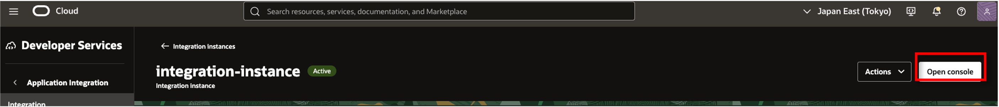
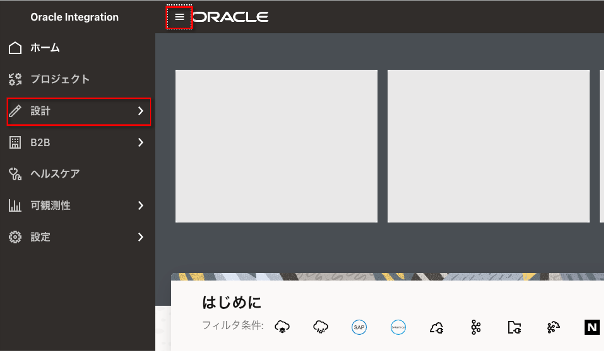
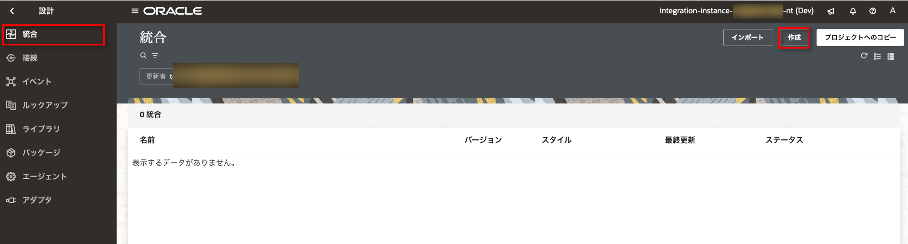
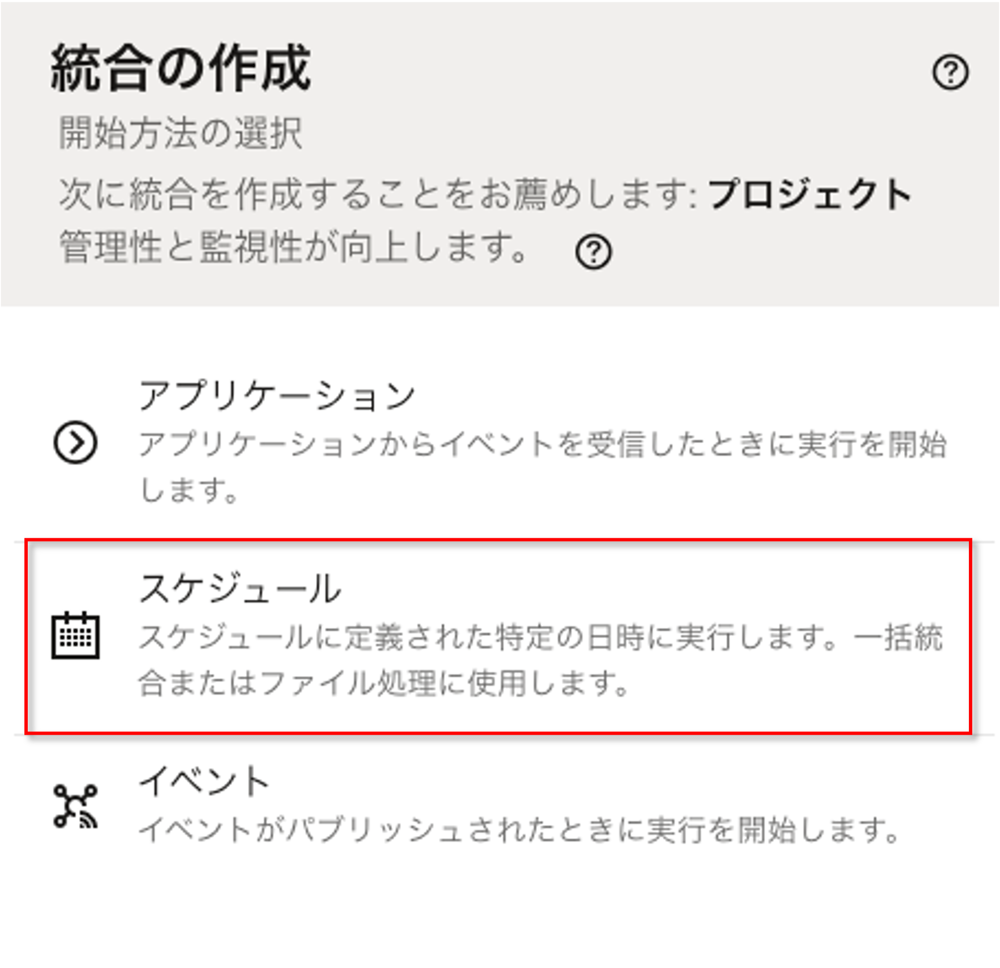
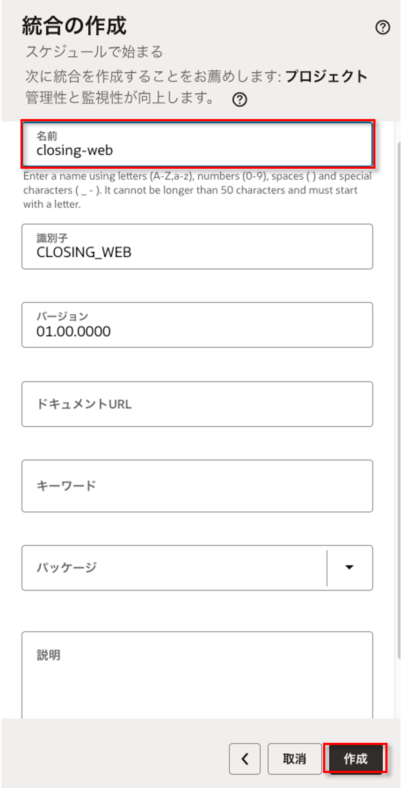
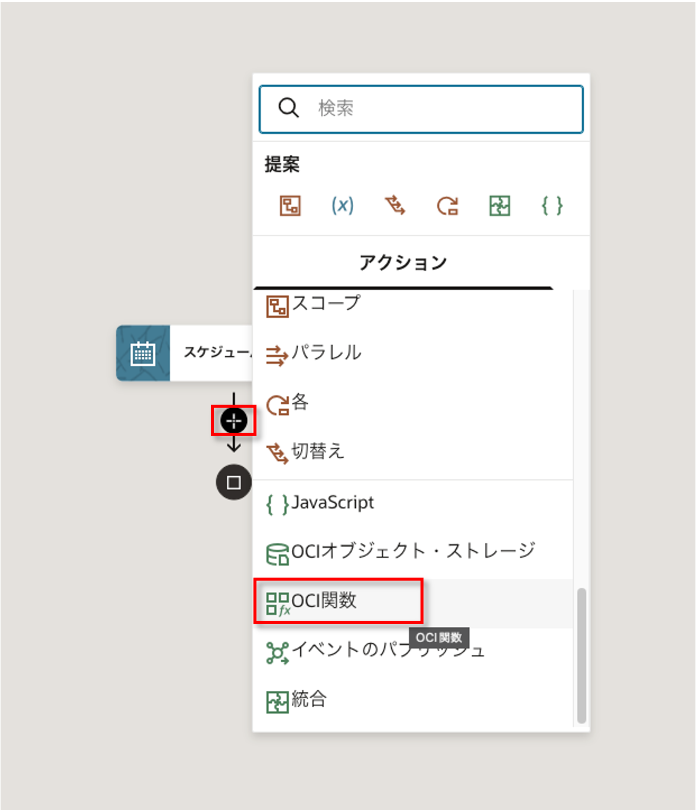
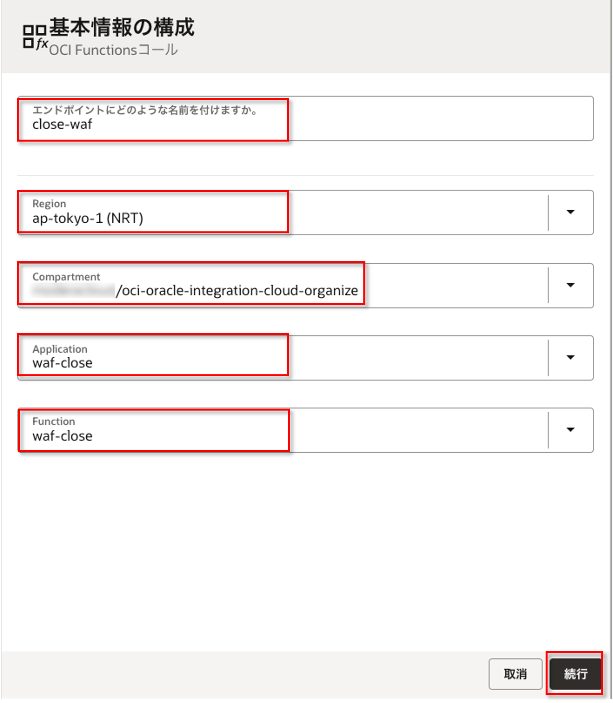
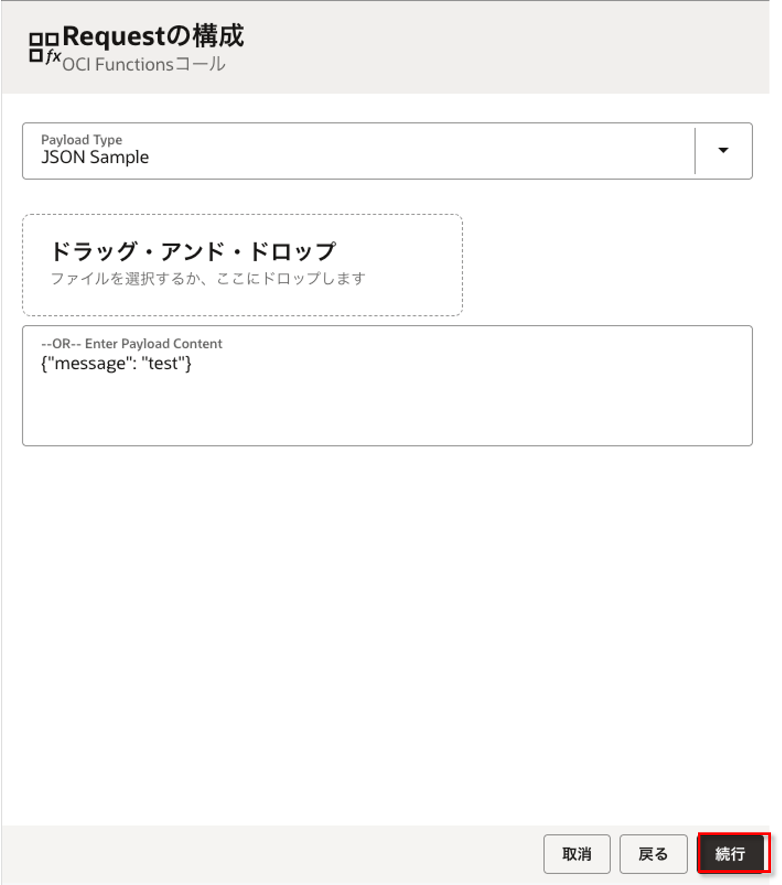
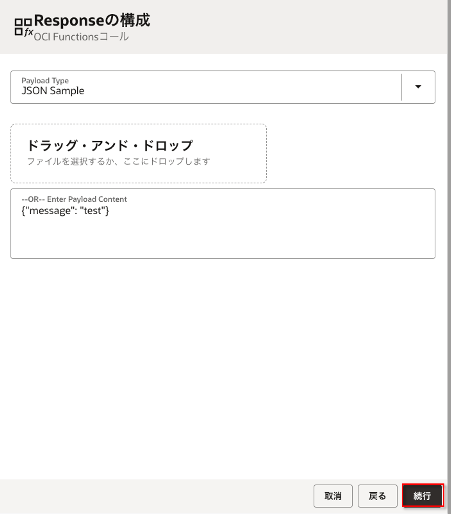
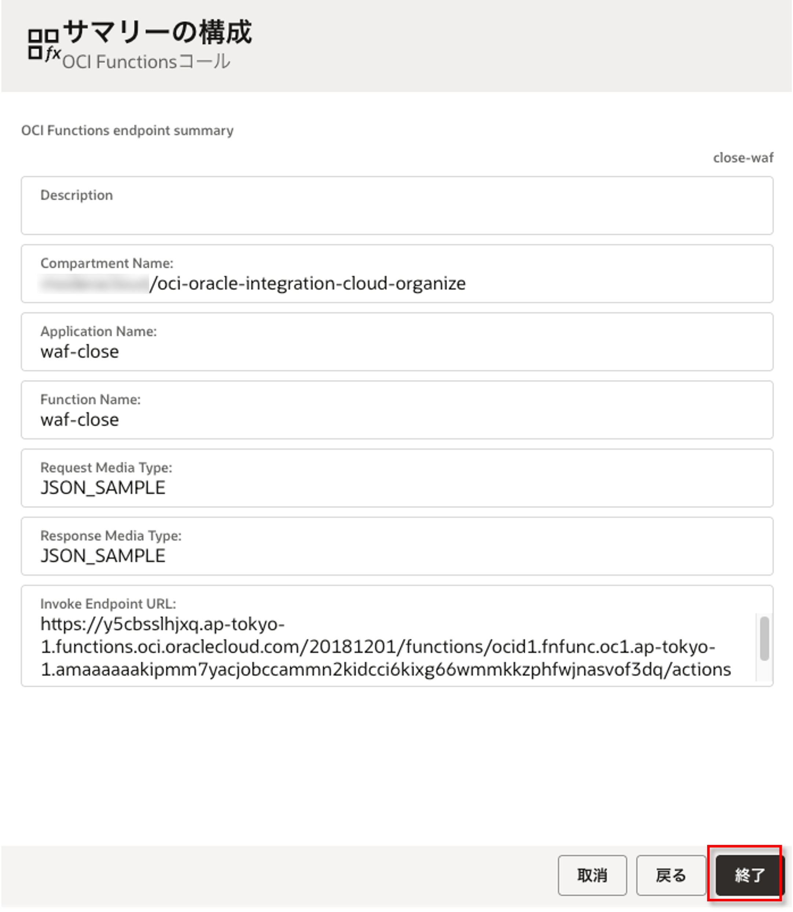

統合作成
=====================================================================
* コンソールアクセス

* ``ハンバーガーマーク`` → ``設計`` をクリック

* ``統合`` → ``作成`` をクリック

* ``スケジュール`` をクリック

* 適当な名前を入力し ``作成`` をクリック

* 矢印上の ``+`` マークをクリックし、 ``OCI関数`` をクリック

* 該当のFunctionsを選択し、 ``続行`` をクリック

* 何かしら入力しないといけないので、適当に入力し ``続行`` をクリック

* 同様に何かしら入力しないといけないので、適当に入力し ``続行`` をクリック

* 最後確認画面がでるので ``終了`` をクリック

.. note:: 

  * 同様の手順で ``compute-stop`` Functions を後段に登録します。
